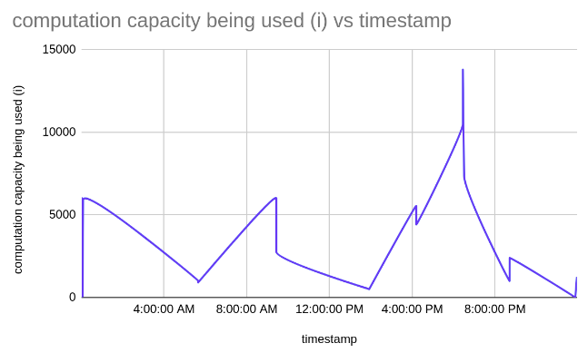
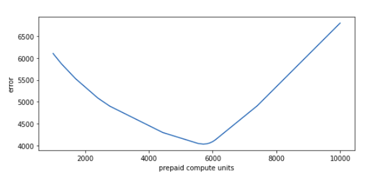

## Capacity usage patterns
- The area under the curve will approximate the total cost of the day.
- The capacity usage pattern is observed to be quantized for most of the instances, i.e. multiple of 500 units.
- Very high value of compute units tells multiple experiments were going on
- The timestamp is given for the first two seconds, this indicates that the process (or a batch of processes) were getting started.
- If the behaviour of the process / experiment was not as expected, more timestamps and compute usage data was given.
- When there is variation in data, more timestamps / data points are given.
- For two consecutive timestamps the usage value is close, this shows that the graph plotted against time and capacity usage will be smooth for most of the time.
- There are a few sudden peaks in the data, but they will add very little to the total cost, because the width of the peak(duration of the peak) is too low compared to the total time.

 

## Missing timestamps
- It could be difficult or expensive to monitor the compute usage for every second, so the only data points where the trend of the curve is changing is given.
- The other missing timestamps probably indicate that the trend of data does not change.
- The value of the missing timestamps can be easily imputed by using linear interpolation.

 ## Optimization approach
 
 x : cost of prepaid compute units
I : number of compute units being used at a given instance

Loss function
loss(i) = 2 * (i -x) 	if i > x
loss(i) = (x-i) 		if i < x

Error function
	Average loss for given set of timestamps

- Since the observed error function is observed to be to a ushaped curve, it has a global minima, at with the value of the error is the least for the given data.
- By using Fmin search optimization function this one dimension function can be optimized
- Lowest value of error is observed to be 4034.1363 at x = 5697.000000000012
Where x is the value of prepaid units

